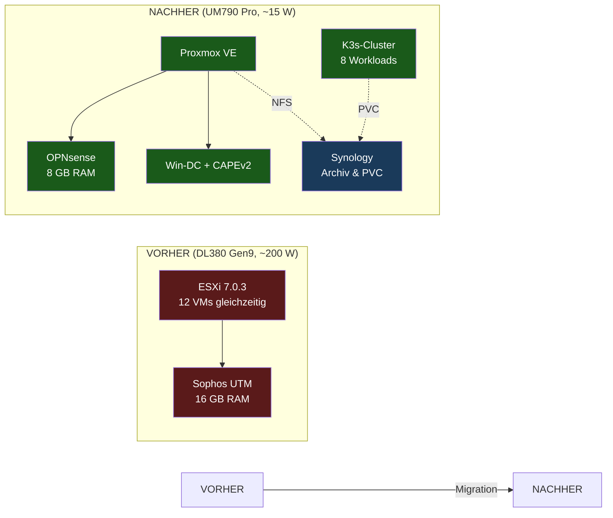

# ESXi → Proxmox Migration

> Ausmusterung eines HP ProLiant DL380 Gen9 ESXi-Hosts zugunsten eines
> stromsparenden Mini-PC mit Proxmox VE — bei gleichzeitiger Modernisierung
> der gesamten Hausnetz-Architektur und 80+ % Stromersparnis.

---

## Kernzahlen

| Kennzahl | Vorher (DL380 Gen9) | Nachher (UM790 Pro) | Veränderung |
|---|---|---|---|
| Idle-Stromverbrauch | ~200 W | ~15 W | **−92,5 %** |
| Jahresstromkosten (30 ct/kWh) | ~525 € | ~39 € | **−486 €/Jahr** |
| Geräuschemission | 45–55 dB(A) | < 25 dB(A) | flüsterleise |
| Rack-Höheneinheiten | 2 U | 0 U (Mini-PC) | ~25 cm Platz frei |
| CPU-Effizienz (PassMark/W) | ~50 | ~720 | **14× besser** |
| Investition (32 GB DDR5 Crucial-Retail, **empfohlen**) | — | **~907 €** ⭐ | Amortisation **~21 Monate** |
| Investition (64 GB DDR5 Crucial-Retail, optional später) | — | ~1.327 € | Amortisation ~31 Monate |

> ⚠️ Lessons Learned aus eBay-Schnäppchen-Fallen siehe **[docs/07-lessons-learned.md](docs/07-lessons-learned.md)**

> 📊 Vollständige Wirtschaftlichkeitsanalyse mit Live-Daten aus
> Home Assistant: **[docs/05-einsparungen.md](docs/05-einsparungen.md)**

## Was hier dokumentiert ist

1. **[Herleitung & Ausgangslage](docs/01-herleitung.md)** — Warum
   überhaupt? Bestandsanalyse des bestehenden Setups, Schmerzpunkte,
   Trigger-Event (abgelaufene Sophos-UTM-Lizenz).
2. **[Hardware-Auswahl](docs/02-hardware-auswahl.md)** — Vergleichsmatrix
   aller Optionen von N100-Sparlösung bis Ryzen-9-Workstation,
   Preisrecherche, Forum-Korrelation, klare Empfehlung.
3. **[Zielarchitektur](docs/03-zielarchitektur.md)** — UM790 Pro mit
   Proxmox VE + OPNsense-VM, K3s-Integration, Storage-Architektur,
   Netz-Topologie inkl. 10 GbE-SFP+ Trunk.
4. **[Migrationspfad](docs/04-migrationspfad.md)** — VM-für-VM Migrations-
   matrix der 12 ESXi-Workloads, Phasenplan mit Risikostaffelung,
   Rollback-Strategie.
5. **[Einsparungen & PV-Synergie](docs/05-einsparungen.md)** — Strom-
   kosten-Berechnung mit echten 30-Tage-Daten aus HA, PV-Eigenverbrauchs-
   quote, ROI, CO₂-Bilanz.
6. **[Integration ins bestehende Setup](docs/06-integration.md)** —
   wie sich die neue Hardware in LAN/Server/Dienste/Applikationen
   einfügt ohne den produktiven Betrieb zu stören.

## Quick-Architektur

## Status

- [x] Analyse Ausgangslage (Stromverbrauch, VM-Inventar)
- [x] Hardware-Recherche (Klasse A/B/C, Schnäppchen-Suche)
- [x] Migrationsmatrix mit strategischen Entscheidungen
- [ ] Hardware-Bestellung
- [ ] Proxmox-Installation
- [ ] OPNsense-Aufbau parallel zur Sophos
- [ ] Cutover OPNsense
- [ ] Phasenweise VM-Migration
- [ ] DL380-Abschaltung & Stromzähler-Verifikation

## Lizenz

MIT — siehe [LICENSE](LICENSE).

Dieses Repository dient als persönliche Migrationsdokumentation und kann
als Vorlage für ähnliche Homelab-Konsolidierungen dienen.
