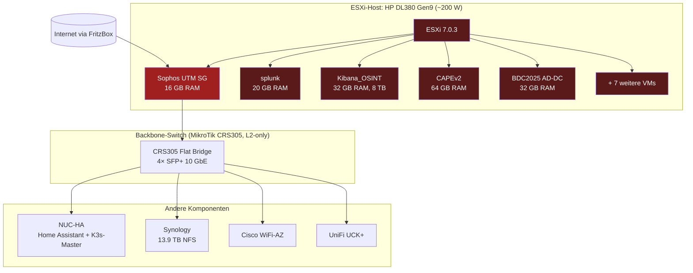

# 01 — Herleitung & Ausgangslage

## Trigger-Event

Die **Sophos UTM SG**-Lizenz ist abgelaufen. Damit fehlen Pattern-Updates
für IPS/AV/Web-Filter — die Firewall-Funktionen laufen zwar weiter, aber
die Security-Substanz erodiert. Statt eine neue Lizenz zu kaufen oder
weiterhin auf einem End-of-Life-Produkt zu sitzen, ist es der ideale
Moment für einen sauberen Plattform-Wechsel.

## Bestehendes Setup (Auszug)

## Erfasste VM-Workloads (12 Stück)

| VM | Funktion | RAM allok. | Real used | Disk | Status |
|---|---|---|---|---|---|
| UTM SG | Firewall (Sophos) | 16 GB | 1,1 GB | 100 GB | aktiv, Lizenz abgelaufen |
| BDC2025 | Active Directory DC (Win Server 2019) | 32 GB | 3,9 GB | 500 GB | aktiv |
| splunk | SIEM / Log-Analyse | 20 GB | 3,7 GB | 860 GB | aktiv |
| Kibana_OSINT | Elastic + Kibana, OSINT-Daten | 32 GB | 1,3 GB | **8 TB** | aktiv, mit Snapshot |
| MailCOW | Self-hosted Mail | 32 GB | — | 500 GB | aus |
| OS-Watch | OSINT-Monitoring | 16 GB | 0,2 GB | 500 GB | aktiv |
| tembo | PostgreSQL-Stack | 32 GB | — | 700 GB | aus (Restore-Leiche) |
| Caldera | MITRE Caldera | 4 GB | 0,2 GB | 150 GB | aktiv |
| CAPEv2 | Malware-Sandbox | 64 GB | 4,6 GB | 850 GB | aktiv, braucht Nested-Virt |
| CheckMK | Monitoring | 8 GB | 0,1 GB | 104 GB | aktiv |
| MWcrawler | OSINT-Crawler | 12 GB | 0,3 GB | 300 GB | aktiv |
| ecoDMS | Dokumentenmanagement | 16 GB | 0,8 GB | 500 GB | aktiv |
| **Summe** | | **284 GB** | **~16 GB** | **~12 TB** | |

### Beobachtungen aus dem Inventar

1. **Massiv overprovisioniert**: 284 GB RAM allokiert, real nur ~16 GB
   in Nutzung → Faktor **18× overcommit**. Spielraum für Migration auf
   kleinere Hardware ist riesig.
2. **Storage primär auf Synology NFS** (~75 % der VMs) — beim
   Plattformwechsel können diese Disks **als-ist** weiterverwendet
   werden, kein Datenumzug.
3. **Heavy-Hitter**: Kibana_OSINT mit 8 TB ist der Storage-Wal —
   strategisches Archiv-Konzept nötig.
4. **Sicherheits-Workloads** (Caldera, CAPEv2, MWcrawler) sind
   containerisierbar und passen besser zu K3s als zu einer Mono-VM.

## Schmerzpunkte des Status quo

### Strom & Wirtschaftlichkeit
- **DL380 Gen9 zieht ~200 W kontinuierlich** (Dual-PSU Redundanz, 16
  RAM-Module, mehrere HDDs, 2× Xeon E5-2600 idle).
- Bei 30 ct/kWh sind das **~525 €/Jahr** allein für den Server.
- Anteil am Hausverbrauch (real gemessen via Tibber Pulse, 30-Tage-
  Durchschnitt: 1012 W Hausgesamt) → **~20 % des Stromverbrauchs geht
  in einen Server**, der nur 16 GB RAM wirklich nutzt.

### Geräusch & Standort
- 6× Hot-Swap-Lüfter, Hot-Air-Ausstoß, im normalen Betrieb 45–55 dB(A).
- Im Wohnumfeld grenzwertig, in Sommer-Hitzeperioden kritisch
  (Lüfter-Hochfahren bei >35 °C Raumtemp).

### Plattform-Risiken
- **VMware ESXi 7**: Lizenz-Modell-Änderung durch Broadcom-Übernahme,
  unklare Zukunft des Free-Tier.
- **DL380 Gen9** (2015er Hardware) wird langsam EOL für ESXi-Support.
- **Sophos UTM** EOL — kein logischer Wachstumspfad.

### PV-Eigenverbrauch
- Bestehende PV-Anlage (kleine ~1,2 kWp Anlage, Schuppen) liefert
  tagsüber 600–1.243 W Spitzenleistung.
- Hausverbrauch tagsüber: 1.100–1.300 W (Server-Sockel ist
  Hauptverbraucher) → **PV deckt selbst zur Mittagszeit den Verbrauch
  oft nicht ab**.
- Ohne den Server-Sockel von 200 W läge der Tagesverbrauch bei
  800–1.000 W — **PV könnte sonnige Tage komplett autark fahren**.

## Zielsetzung

| Dimension | Ziel |
|---|---|
| Stromverbrauch | < 30 W kontinuierlich (statt 200 W) |
| Firewall-Plattform | OPNsense (Open-Source, aktiv gepflegt, lizenzfrei) |
| Konsolidierung | DL380 vollständig außer Betrieb, alle VMs auf moderne Plattform |
| Modernisierung | K3s für containerisierbare Workloads, VMs nur wo nötig |
| Geräusch | Lüfterlos / flüsterleise |
| Storage | Synology bleibt zentraler Anker, NFS-Anbindung an Proxmox |
| Rollback-Fähigkeit | Sophos UTM bleibt während Migration in Standby |

## Warum Proxmox VE?

| Kriterium | Proxmox VE | ESXi 7 (Bestand) | Hyper-V |
|---|---|---|---|
| Lizenz | Open Source (kostenpflichtiger Support optional) | Broadcom-Lizenz, unklar | Windows-Server-Lizenz |
| Web-UI | Modern, vollumfänglich | Vorhanden, Free-Tier eingeschränkt | nur via SAC/Mgmt |
| Storage | ZFS native, Ceph, NFS, iSCSI | VMFS, NFS | CSV, SMB |
| Backup | Proxmox Backup Server (kostenlos!) | Veeam separat | DPM |
| Container | LXC native, plus Docker-Support | nein | nein |
| Cluster | nativ ab 3 Nodes ohne Aufpreis | kostet | kostet |
| Community | Sehr groß, Forum aktiv | abnehmend nach Broadcom | klein |
| Hardware-Support für AMD Ryzen | ausgezeichnet | mittel | gut |

## Nächste Schritte

1. Hardware-Recherche und Auswahl → **[02-hardware-auswahl.md](02-hardware-auswahl.md)**
2. Zielarchitektur entwerfen → **[03-zielarchitektur.md](03-zielarchitektur.md)**
3. Pro VM Migrationsentscheidung treffen → **[04-migrationspfad.md](04-migrationspfad.md)**
