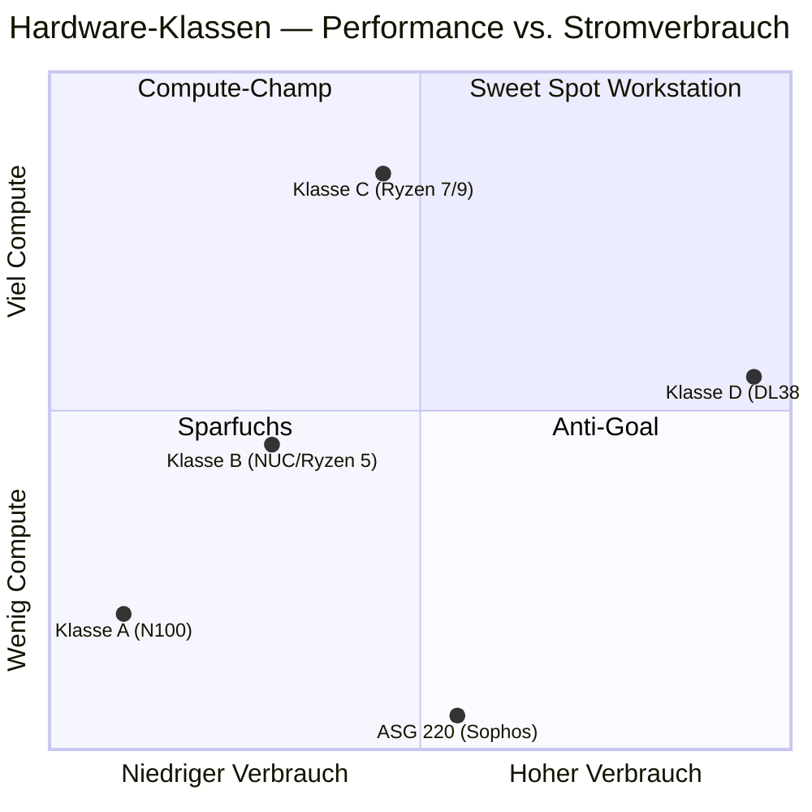

# 02 — Hardware-Auswahl

## Bewertungskriterien

Für den DL380-Ersatz wurden vier Klassen evaluiert:

## Klassen im Detail

### Klasse A — Sparfuchs (N100 / N305)
- **Beispiel-Modelle**: CWWK F2, X86-P5, Topton 4× 2.5G
- **Idle**: 6–10 W, **Volllast**: 18–28 W
- **Use Case**: reine Firewall + 1–2 leichte VMs
- **Schwäche**: zu wenig CPU für die DL380-Workloads
- **Preis neu**: 200–280 €

### Klasse B — Compute-Erweiterung (NUC / Lenovo Tiny / HP EliteDesk)
- **Beispiel-Modelle**: NUC10/11/12 Pro, Lenovo M75q-2, HP EliteDesk 800 G6
- **Idle**: 8–15 W, **Volllast**: 35–50 W
- **Use Case**: Firewall + 3–5 mittlere VMs
- **Schwäche**: meist nur 1× 1G NIC, 10G nur via TB3 (Treiber-Lottery)
- **Preis gebraucht**: 130–330 €

### Klasse C — Workstation (Ryzen 7/9 HS)
- **Beispiel-Modelle**: Minisforum UM790/UM890 Pro, Beelink SER6/7,
  GMKtec K8 Plus, ACEMAGICIAN AM18
- **Idle**: 12–18 W, **Volllast**: 60–85 W
- **Use Case**: Firewall + 6–8 produktive VMs + Container-Workloads
- **Stärke**: 8C/16T Zen4, 64 GB RAM möglich, 2× 2.5G NIC, USB4 für 10G
- **Preis neu**: 400–700 €; **refurbished**: ab **299 €**

### Klasse D / Anti-Goal — alte Server-Hardware
- DL380 (Status quo), Sophos ASG 220 (alte Hardware)
- Stromverbrauch unverhältnismäßig hoch — verfehlt das Sparziel
- Eignet sich höchstens als **Lab-/Test-Gerät**

## Vergleichsmatrix mit aktuellen Marktpreisen (Mai 2026)

| Modell | CPU | iGPU | NICs | RAM (max) | Idle / Last | Preis neu | Preis gebraucht |
|---|---|---|---|---|---|---|---|
| CWWK F2 N100 | N100 (4C/4T) | UHD | 4× 2,5 G | 16 GB | 8 / 22 W | 220 € | 150 € |
| CWWK F2 N305 | i3-N305 (8C/8T) | UHD | 4× 2,5 G | 32 GB | 12 / 28 W | 320 € | 240 € |
| NUC8i7BEH | i7-8559U (4C/8T) | Iris+ | 1× 1 G | 32 GB (inoffiz. 64) | 7 / 45 W | — | 130–180 € |
| Lenovo M75q-2 | Ryzen 5 PRO 5650GE | Vega 7 | 1× 1 G | 64 GB | 10 / 35 W | — | 250–330 € |
| Beelink SER6 Pro | Ryzen 9 6900HX | 680M | 2× 2,5 G | 64 GB | 12 / 65 W | 480 € | 280–380 € |
| Beelink SER7 | Ryzen 7 7840HS | 780M | 1× 2,5 G | 64 GB | 13 / 65 W | 550 € | 350–430 € |
| GMKtec K8 Plus | Ryzen 7 8845HS | 780M | 2× 2,5 G | 96 GB | 15 / 65 W | 400 € | — |
| **Minisforum UM790 Pro (refurb.)** | **Ryzen 9 7940HS** | **780M** | **2× 2,5 G** | **64 GB** | **13 / 65 W** | **679 €** | **299 €** ⭐ |
| Minisforum UM890 Pro (refurb.) | Ryzen 9 8945HS | 780M | 2× 2,5 G | 96 GB | 15 / 70 W | 689 € | 399 € |
| Minisforum MS-01 | i9-13900H | UHD | **2× 10 G SFP+** | 96 GB | 15 / 75 W | 1.300 € | 950 € |

## Schnäppchen-Recherche

### Top-Treffer: Minisforum Refurbished EU-Shop

Direkter Hersteller-Refurbished-Shop mit verifizierten Preisen aus der
Shopify-API (Stand Mai 2026), Versand aus deutschem Lager, 30 Tage Rückgabe.

| Modell | Konfiguration | Preis | UVP | Rabatt |
|---|---|---|---|---|
| UM760 Pro | Barebone (R5 7640HS) | 199 € | 359 € | −45 % |
| UM760 Pro | 32 GB + 1 TB | 349 € | 589 € | −41 % |
| **UM790 Pro** | **Barebone (R9 7940HS)** | **299 €** | 679 € | **−56 %** ⭐ |
| UM790 Pro | 32 GB + 1 TB | 599 € | 929 € | −36 % |
| UM790 Pro | 64 GB + 1 TB | 699 € | 1.089 € | −36 % |
| UM890 Pro | Barebone (R9 8945HS) | 399 € | 689 € | −42 % |
| UM890 Pro | 32 GB + 1 TB | 589 € | 929 € | −37 % |
| UM890 Pro | 64 GB + 1 TB | 659 € | 1.039 € | −37 % |

**Quelle**: [minisforumpc.eu Refurbished](https://minisforumpc.eu/products/um760-pro-um790-pro-um890-pro-refurbished)

### Weitere Schnäppchen-Quellen

| Quelle | Was | Hinweis |
|---|---|---|
| [mydealz.de Mini PC](https://www.mydealz.de/gruppe/mini-pc) | Daily Deals, Community-Hinweise | Alarm-Funktion nutzen |
| [Beelink EU-Store](https://www.bee-link.com/) | Coupon-Codes wie `SER6PRO7735HS30` (−50 %) | kurze Laufzeit |
| Amazon Warehouse | Filter "Gebraucht / Sehr gut" auf Beelink/Minisforum | 20–30 % unter Neupreis |
| eBay Kleinanzeigen | Privatverkäufer, oft lokal | Bilder Rückseite zählen (NICs!) |
| Slickdeals | ACEMAGICIAN AM18 historisch 399 $ | regelmäßig prüfen |

## Forum-Korrelation

Was sagen die einschlägigen Foren?

| Modell | Foren-Reputation für Proxmox + OPNsense |
|---|---|
| **Beelink SER6 Pro** | "Robusteste Klasse-C-Wahl", NIC-Passthrough out-of-the-box, niedriger Idle (Level1Techs, ServeTheHome) |
| Beelink SER7 | Vapor-Chamber gute Kühlung, **aber nur 1× 2,5 G** — Bottleneck für Firewall mit physischer WAN/LAN-Trennung (STH-Review) |
| Beelink SER8 | Power-Efficiency-Champion (7–10 W idle), aber wie SER7 nur 1× NIC |
| **Minisforum UM790 Pro** | Sehr leise, USB4 für 10G, vereinzelt NIC-Erkennungsprobleme nach Reboot (Proxmox-Forum) |
| Minisforum UM890 Pro | Wie UM790, neuere CPU mit NPU |
| GMKtec K8 Plus | Gute Hardware, **GPU-Passthrough buggy** (AMD Reset Bug, [GitHub Issue](https://github.com/isc30/ryzen-gpu-passthrough-proxmox/issues/118)) — für OPNsense irrelevant, weil NIC-Passthrough geht |
| Topton N17 8845HS | **IOMMU-Bug** auf einigen Mainboards ([Proxmox-Forum](https://forum.proxmox.com/threads/topton-nas-motherboard-n17-not-sure-with-ryzen-8845hs-issue-with-iommu-and-amd-vt.152871/)) |
| Generic AliExpress | Firmware-Lottery, BIOS-Updates rar — Risiko |

## Entscheidung

**Minisforum UM790 Pro Refurbished Barebone @ 299 €** als Basis.

Begründung:
1. **Bester Preis-Leistungs-Punkt der Klasse C** (−56 % vom UVP)
2. **Ryzen 9 7940HS** (8C/16T Zen4) — ~3× CPU-Leistung der ESXi-Last
3. **2× Intel I226 2,5 G** onboard — saubere WAN/LAN-Trennung für OPNsense
4. **2× USB4 (40 Gbps)** — 10G-Erweiterung möglich via QNAP-Adapter
5. **64 GB DDR5-5600 SODIMM** offiziell unterstützt
6. **2× M.2 2280 PCIe 4.0** — ZFS-Mirror möglich
7. **Refurbished durch Hersteller** mit 30 Tagen Rückgabe und
   EU-Versand
8. **Idle ~13 W** — über 90 % weniger als DL380

## Komplettes Setup — Bill of Materials

### ⚠️ Wichtige Preis-Korrektur (Mai 2026)

DDR5 SODIMM ist 2024–2026 wegen HBM/AI-Nachfrage stark gestiegen. **Live-Preise vor Bestellung im Browser verifizieren** — die hier genannten Werte sind Schätzungen aus US-Listen (Best Buy $629, Walmart $599 für 64 GB Kit) und können in DE abweichen.

### Variante B — empfohlen (32 GB RAM, ~877 €)

Realer RAM-Bedarf des aktuellen ESXi-Setups: **~16 GB** (alle 12 VMs zusammen). Nach K3s-Offload der leichten Workloads bleiben auf dem UM790 nur Proxmox + OPNsense + BDC2025 + CAPEv2 (~36 GB allokiert). 32 GB sind eng, aber via Memory-Ballooning und Swap auf NVMe machbar.

| Position | Modell | Funktion | Preis | Quelle |
|---|---|---|---|---|
| Mainboard/Gerät | Minisforum UM790 Pro Refurbished Barebone | R9 7940HS, Gehäuse, NT | **299 € (verifiziert)** | [minisforumpc.eu](https://minisforumpc.eu/products/um760-pro-um790-pro-um890-pro-refurbished) |
| RAM | Crucial 32 GB DDR5-5600 SODIMM Kit (CT2K16G56C46S5) | Hauptspeicher | ~150 € | Mindfactory / Amazon DE (Live prüfen) |
| Storage 1+2 | 2× WD Black SN770 1 TB | ZFS-Mirror | ~140 € | Mindfactory (Live prüfen) |
| 10G NIC | QNAP QNA-T310G1S (SFP+) | 10G-Trunk an CRS305 | ~260 € | Amazon DE (Live prüfen) |
| DAC-Kabel | MikroTik S+DA0001 1 m | Direktverbindung CRS305 | ~28 € | Amazon DE |
| **Summe Variante B** | | | **~877 €** | |

### Variante A (REAL!) — Samsung-OEM-Schnäppchen 64 GB (~926 €)

Dank eines eBay-Schnäppchens (Samsung M425R4GA3BB0-CWM 64 GB Kit OEM für **199 €** statt 600 € Crucial-Retail) ist der 64-GB-Vollausbau jetzt **wirtschaftlicher** als die 32-GB-Variante.

### Variante A (Listpreis) — Vollausbau (64 GB RAM, ~1.327 €)

Nur sinnvoll, wenn nach 3–6 Monaten Betrieb der RAM tatsächlich knapp wird. DDR5-Preise fallen voraussichtlich Ende 2026, wenn HBM-Kapazitäten online kommen → späteres Upgrade ist günstiger.

| Position | Modell | Preis |
|---|---|---|
| UM790 Pro Refurb Barebone | wie oben | 299 € |
| Crucial 64 GB DDR5-5600 Kit (CT2K32G56C46S5) | **~600 €** | [Crucial.com Produktseite](https://www.crucial.com/memory/ddr5/ct2k32g56c46s5) · [Amazon US](https://www.amazon.com/Crucial-5600MHz-5200MHz-4800MHz-CT2K32G56C46S5/dp/B0BLTG7TN6) |
| 2× SN770 1 TB | wie oben | 140 € |
| QNAP QNA-T310G1S + DAC | wie oben | 288 € |
| **Summe Variante A** | | **~1.327 €** |

### Variante C — Upgrade-Pfad

Start mit Variante B (32 GB) → falls nötig später 32 GB hinzukaufen oder auf 2× 32 GB Module umstecken. Empfohlene Strategie.

### Optional / Nice-to-have

| Position | Modell | Preis | Wann sinnvoll? |
|---|---|---|---|
| USB-Serial-Adapter | UGREEN FT232 | 15 € | für OPNsense-Konsolen-Setup ohne Bildschirm |
| Externes M.2-Gehäuse | USB4/TB3 | 50 € | für VM-Migration (Offline-Disk-Klon) |
| Zweiter UM790 Pro | für Proxmox-Cluster (HA) | 299 € | später, falls Verfügbarkeit kritisch |

## Nicht ausgewählte Alternativen

- **NUC8i7BEH @ 160 €** (Aktuelles eBay-Angebot): nur 1× 1G NIC, 10G nur
  über teuren TB3-Adapter mit Treiber-Lottery, CPU ~⅓ der Leistung des
  R9 7940HS. **Gesamtkosten nach Aufrüstung höher** als UM790-Refurb.
- **Sophos ASG 220** (vorhanden): 70 W Volllast, Atom N450 ohne AES-NI,
  IPsec-Throughput < 80 Mbps — verfehlt Stromsparziel. Geeignet nur als
  Lab-/Test-Gerät.
- **CRS305 als Router/Firewall**: schwache ARM-Single-Core-CPU, kein
  AES-NI, IPsec ~30 Mbps — würde die bestehende L2-Backbone-Funktion
  gefährden.

## Weiter

→ **[03-zielarchitektur.md](03-zielarchitektur.md)** — wie die Hardware
ins bestehende Setup eingebettet wird.
