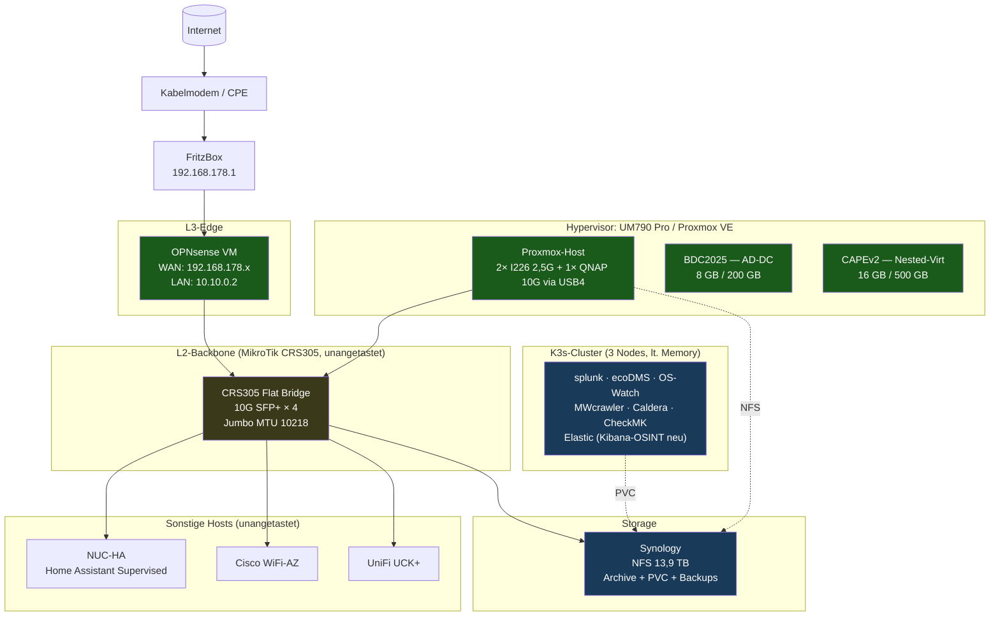
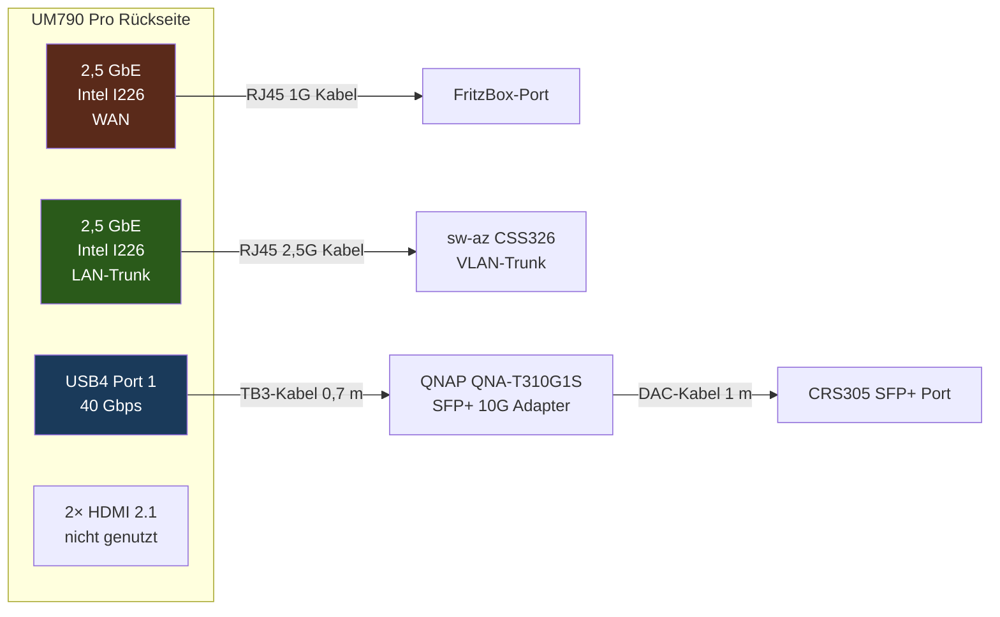
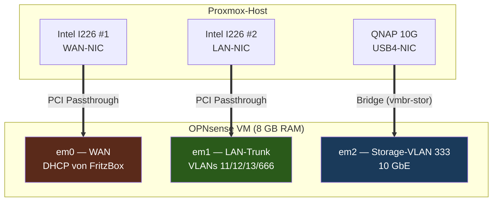
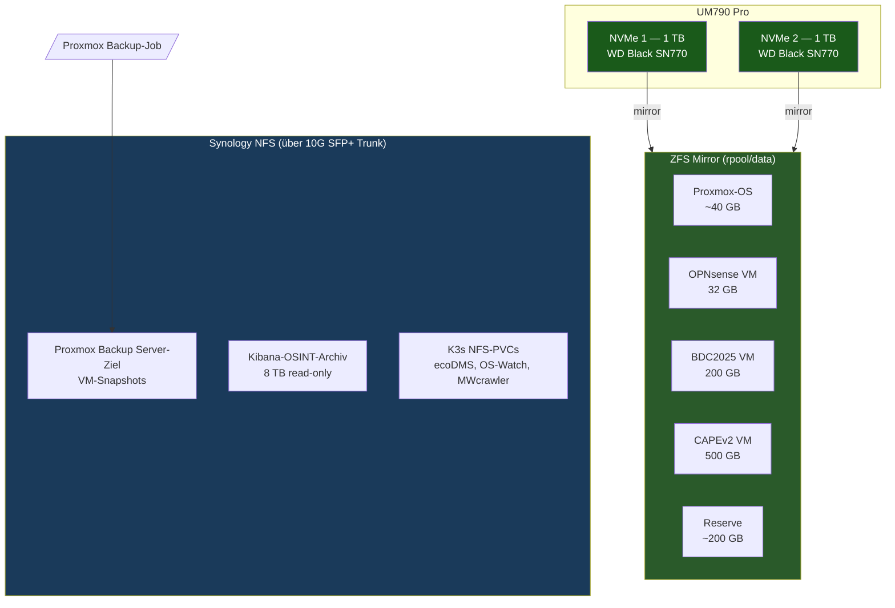
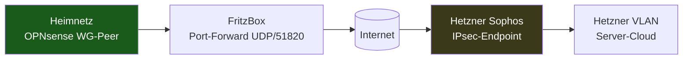

# 03 — Zielarchitektur

## Übersicht — Logische Sicht

## Physische Verkabelung am UM790 Pro

## OPNsense — Virtualisierungsdesign

**Designentscheidungen**:

| Aspekt | Entscheidung | Begründung |
|---|---|---|
| WAN-NIC | PCI-Passthrough Intel I226 | Maximale Trennung Host ↔ Gast, sicherer |
| LAN-NIC | PCI-Passthrough Intel I226 | OPNsense bekommt rohen VLAN-Trunk |
| 10G NIC | über Proxmox-Bridge (nicht Passthrough) | USB4-Passthrough mit FreeBSD nicht zuverlässig |
| RAM | 8 GB (statt 16 GB der alten UTM) | Real-RAM-Bedarf liegt bei ~1,5 GB |
| Disk | 32 GB virtio | OPNsense braucht keine 100 GB |
| CPU | 4 vCPU, NUMA off | Reserve für IDS/IPS |

## Storage-Strategie

**Storage-Tiers**:

| Tier | Was | Worauf |
|---|---|---|
| **Hot** (NVMe local) | OS, Boot-Disks, häufig genutzte VMs | ZFS-Mirror auf UM790 |
| **Warm** (10G NFS) | VM-Disks die kein NVMe brauchen, Snapshots | Synology Volume2 |
| **Cold** (NFS read-only) | Archive, alte OSINT-Daten | Synology Archiv-Share |

## Netz-Integration ins bestehende Setup

Das bestehende **L2-Backbone (MikroTik CRS305)** bleibt **unverändert**:

- Bridge bleibt flat (`vlan-filtering=no`)
- L2 MTU 10218 (Jumbo Frames für Storage-VLAN 333)
- Bestehende Verkabelung der anderen Switches/Hosts unangetastet

**Neuer Anschluss CRS305**:

| CRS305 Port | Vorher | Nachher |
|---|---|---|
| sfp1 | → sw-keller P25 | unverändert |
| sfp2 | unused | **→ UM790 (QNAP 10G SFP+, VLAN 333 für Storage)** |
| sfp3 | → Cisco WiFi-WZ | unverändert |
| sfp4 | → sw-az P24 | unverändert |

Der **UM790-LAN-Port (I226 2,5 G)** geht in den bestehenden Trunk-Port
am sw-az / sw-keller — VLAN-Tagging übernimmt OPNsense.

## VLAN-Schema (unverändert)

Das bestehende VLAN-Schema bleibt 1:1 erhalten — nur das Default-Gateway
pro VLAN wandert von der Sophos zur OPNsense:

| VLAN | Zweck | Subnet | Gateway (neu) |
|---|---|---|---|
| 1 | Mgmt | 10.10.0.0/24 | 10.10.0.2 (OPNsense) |
| 11 | Mgmt extended | 10.10.10.0/24 | 10.10.0.2 |
| 12 | IoT | 10.10.12.0/24 | bleibt UniFi USG für DHCP |
| 13 | Bad-Zone | 10.10.13.0/24 | 10.10.13.1 (OPNsense) |
| 333 | Storage | 10.10.33.0/24 | OPNsense (nur Routing, kein DHCP) |
| 666 | Internet/FB | 192.168.178.0/24 | FritzBox |

## VPN-Endpunkt zu Hetzner

Bestehender IPsec/SSL-Tunnel zur Hetzner-Sophos wird **als WireGuard auf OPNsense** neu aufgebaut:

**Optionen**:

| Variante | Vorteil | Nachteil |
|---|---|---|
| WireGuard end-to-end (beide Seiten WG) | schneller, einfacher, modern | erfordert Konfig auch auf Hetzner-Seite |
| IPsec wie bisher | Sophos-Seite unverändert | mehr Konfig-Aufwand auf OPNsense |
| Hybrid (WG für neue Routen, IPsec übergangsweise) | sanfter Cutover | doppelte Verwaltung |

→ **Entscheidung**: WireGuard end-to-end, Hetzner-Sophos wird parallel
umgestellt (separates Projekt).

## Hardware-Investitionen ins bestehende Setup integrieren

| Bestehende Komponente | Wird verändert? | Wie integriert? |
|---|---|---|
| HP DL380 Gen9 | ❌ wird abgeschaltet | nach erfolgreichem Cutover dauerhaft aus |
| Sophos UTM SG | ❌ wird durch OPNsense ersetzt | Config-Export als Referenz |
| MikroTik CRS305 | ✅ bleibt unverändert | nur ein zusätzlicher SFP+-Port belegt |
| sw-az / sw-keller (CSS326) | ✅ bleibt unverändert | Trunk-Port am sw-az nimmt UM790 |
| Synology | ✅ bleibt unverändert | zusätzliche NFS-Shares für Proxmox + K3s-PVCs |
| NUC-HA | ✅ bleibt unverändert | übernimmt K3s-Master-Rolle wie bisher |
| K3s-Cluster (3 Nodes) | ✅ erweitert | 8 neue Workloads via Helm-Charts |
| Cisco WiFi-AZ / WZ | ✅ bleibt unverändert | nur Default-Gateway-Mac wird auf OPN umgestellt |
| FritzBox | ✅ bleibt unverändert | Port-Forward für WG-Endpunkt |
| UniFi UCK+ | ✅ bleibt unverändert | weiter DHCP für VLAN 12 (Bad:IoT) |

→ **Keine Eingriffe ins bestehende L2-Backbone**, **kein Re-Patching**
der anderen Server. Migration ist additiv: UM790 wird parallel
hochgezogen, alte Sophos bleibt bis zum Cutover live, dann IP-Tausch
und Sophos wird heruntergefahren.

## Weiter

→ **[04-migrationspfad.md](04-migrationspfad.md)** — Phasen-Plan mit
VM-für-VM Migration.
