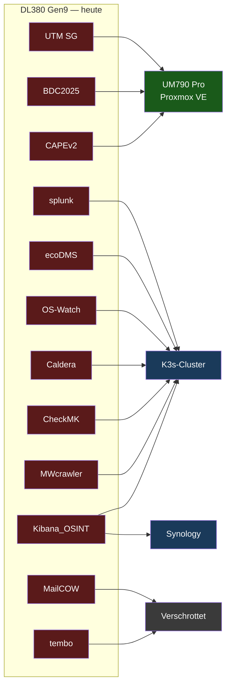
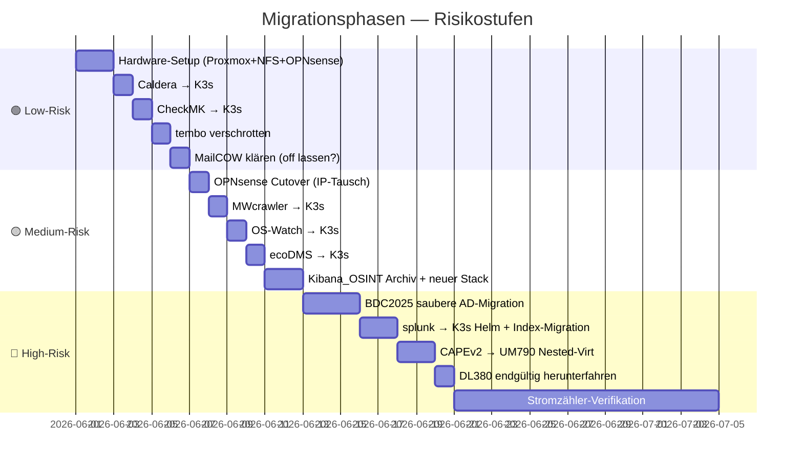
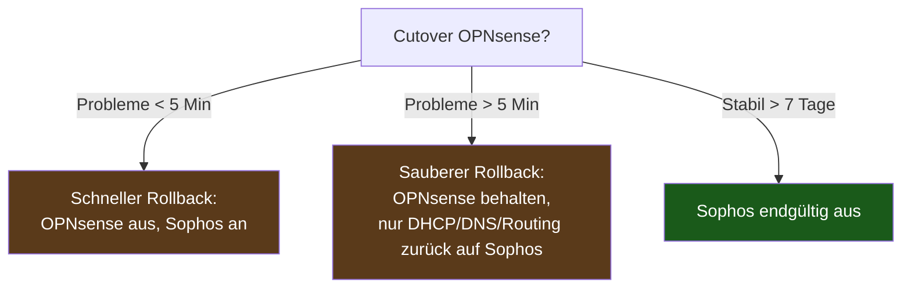

# 04 — Migrationspfad

## Migrationsmatrix



## Detail-Matrix mit Entscheidungen

| VM | RAM alt → neu | Ziel | Migrationspfad | Komplexität |
|---|---|---|---|---|
| **UTM SG** | 16 GB → 8 GB | OPNsense auf UM790 | Neu aufgebaut, Sophos-Config als Referenz | 🟡 Mittel |
| **BDC2025** (AD-DC) | 32 GB → 8 GB | UM790 Proxmox-VM | Saubere AD-Migration: neuer DC promoten, FSMO transferieren, alten demoten | 🔴 Hoch — AD-spezifisch |
| **splunk** | 20 GB → 8 GB | K3s Helm-Chart | `splunk-enterprise` Helm-Chart, Index-Migration via OTel | 🔴 Hoch |
| **ecoDMS** | 16 GB → 4 GB | K3s | Offizielles Container-Image, NFS-PVC auf Synology | 🟢 Niedrig |
| **Kibana_OSINT** | 32 GB → 8 GB | K3s neu + Archiv | Snapshot konsolidieren → 8 TB auf Synology archivieren → frischer Elastic auf K3s | 🟡 Mittel |
| **MailCOW** | 32 GB → — | ❌ Verschrottet (off) | Falls aktiv: docker-compose NUC-HA | 🟢 Trivial (off) |
| **OS-Watch** | 16 GB → 4 GB | K3s | Container-Build + Deploy, NFS-PVC | 🟢 Niedrig |
| **tembo** | 32 GB → — | ❌ Verschrottet | Restore-Leiche, monatelang off | 🟢 Trivial |
| **Caldera** | 4 GB → 2 GB | K3s | Offizieller Helm-Chart vorhanden | 🟢 Sehr niedrig |
| **CAPEv2** | 64 GB → 16 GB | UM790 Nested-Virt | Proxmox `kvm-amd nested=1`, VM `cpu=host,+svm` | 🔴 Hoch — Nested-KVM |
| **CheckMK** | 8 GB → 2 GB | K3s | Offizieller Helm-Chart | 🟢 Sehr niedrig |
| **MWcrawler** | 12 GB → 4 GB | K3s | Container-Build, NFS-PVC | 🟢 Niedrig |

**RAM-Reduktion gesamt**: 284 GB → 64 GB (UM790) + ~32 GB verteilt auf
K3s-Nodes = **−68 % allokierter RAM**, ohne Verlust echter Nutz-Kapazität
(reale Nutzung lag bei nur 16 GB).

## Phasenplan mit Risiko-Staffelung



## Migrations-Sequenz im Detail

### Phase 0 — Vorbereitung (vor Hardware-Lieferung)

| Schritt | Was | Risiko |
|---|---|---|
| 0.1 | Sophos UTM Web-Admin → Backup-XML exportieren | 🟢 |
| 0.2 | Sophos Firewall-Regeln, NAT, VPN-Endpoints, DHCP-Reservations in Excel/CSV inventarisieren | 🟢 |
| 0.3 | Kibana_OSINT VM-Snapshot konsolidieren (sonst Migration kaputt) | 🟡 |
| 0.4 | Vollbackup aller VMs via ESXi → Synology | 🟢 |
| 0.5 | Powered-Off-VMs (MailCOW, tembo) endgültig markieren | 🟢 |

### Phase 1 — UM790-Setup (Tag 1)

| Schritt | Was | Risiko |
|---|---|---|
| 1.1 | Proxmox VE 8.x ISO via USB installieren, ZFS-Mirror auf 2× NVMe | 🟢 |
| 1.2 | Netz: `vmbr0` für WAN-NIC (Passthrough), `vmbr1` für LAN-NIC (Passthrough), `vmbr10g` für USB4 10G | 🟢 |
| 1.3 | NFS-Mount zur Synology als zusätzlicher Storage `synology-nfs` | 🟢 |
| 1.4 | Proxmox Backup Server-Ziel auf Synology einrichten | 🟢 |

### Phase 2 — OPNsense (Tag 2)

| Schritt | Was | Risiko |
|---|---|---|
| 2.1 | OPNsense-VM erstellen (4 vCPU, 8 GB RAM, 32 GB Disk, 3 NICs) | 🟢 |
| 2.2 | OPNsense via ISO installieren, Basis-Setup | 🟢 |
| 2.3 | Sophos-Backup-XML parsen, Firewall-Regeln in OPNsense nachbauen | 🟡 |
| 2.4 | NAT, DHCP, VLAN-Interfaces, statische Routen einrichten | 🟡 |
| 2.5 | WireGuard-Peer zur Hetzner-Seite konfigurieren | 🟡 |
| 2.6 | **Parallel-Betrieb**: OPNsense auf 10.10.0.3, Sophos auf 10.10.0.2 | 🟢 |

### Phase 3 — OPNsense Cutover (Tag 3)

| Schritt | Was | Risiko |
|---|---|---|
| 3.1 | Sophos UTM auf DL380 herunterfahren (NICHT löschen!) | 🟡 |
| 3.2 | OPNsense LAN-IP auf 10.10.0.2 umstellen | 🟡 |
| 3.3 | DHCP-Server der Hosts neu starten lassen oder Renewal abwarten | 🟢 |
| 3.4 | Connectivity-Test: Hetzner-Tunnel, AdGuard-DNS, VLAN-Routing | 🟡 |
| 3.5 | **Rollback-Trigger**: Wenn Probleme → OPNsense aus, Sophos wieder an | 🟢 (vorbereitet) |

### Phase 4 — K3s-Migrationen (Tag 4-7)

Für jede der 5 leichten Container-VMs (Caldera, CheckMK, MWcrawler,
OS-Watch, ecoDMS):

```bash
# Pseudocode für jede VM:
1. Helm-Repo hinzufügen (oder Dockerfile vorbereiten)
2. values.yaml mit NFS-PVC, Ressourcen-Limits, Ingress
3. helm install <name> ... --namespace <name>
4. Daten-Migration: rsync von Synology-NFS-Mount der alten VM
5. DNS / Ingress umschalten (oder Reverse-Proxy auf neuen Service)
6. Test: alte Schnittstellen funktionieren?
7. Alte VM auf ESXi stoppen, 7 Tage in Standby, dann löschen
```

### Phase 5 — Kibana_OSINT (Tag 8-9)

```bash
# 1. Snapshot in ES vor Migration
POST /_snapshot/synology_archive/snapshot_2026_06?wait_for_completion=true

# 2. Snapshot-Files auf Synology-Archiv-Volume schieben
# 3. Alte VM final herunterfahren, vmdk-Dateien als Archiv aufbewahren
# 4. Neuer Elastic+Kibana auf K3s via Helm (klein, ~8 GB RAM, 500 GB PVC)
# 5. Nur die wirklich benötigten Indizes restorieren
```

### Phase 6 — BDC2025 AD-DC (Tag 10-12)

**Niemals klonen!** USN-Rollback-Risiko.

```powershell
# Variante: neuer DC + Demote alter DC
1. Neue Windows-Server-VM auf UM790 Proxmox
2. AD-DS Rolle installieren, Domain joinen
3. dcpromo → Read-Only oder Full-DC
4. Replication abwarten: repadmin /showrepl
5. FSMO-Rollen transferieren (Move-ADDirectoryServerOperationMasterRole)
6. DNS-Service-Records auf neuen DC umstellen
7. Alten DC: dcpromo /remove (sauber demoten)
8. Alte VM auf ESXi stoppen, 14 Tage in Standby
```

### Phase 7 — splunk → K3s (Tag 13-14)

```yaml
# splunk-enterprise Helm-Chart values.yaml (Auszug)
splunk:
  s2s:
    enabled: true
    port: 9997
  hec:
    enabled: true
storage:
  storageClass: nfs-synology
  size: 300Gi
resources:
  requests: { cpu: 1, memory: 4Gi }
  limits:   { cpu: 4, memory: 8Gi }
```

Indizes via `splunk-otel-collector` oder Cribl Stream migrieren.

### Phase 8 — CAPEv2 (Tag 15-16)

```bash
# Proxmox-Host: Nested-Virt aktivieren
echo "options kvm-amd nested=1" > /etc/modprobe.d/kvm-amd.conf
update-initramfs -u
reboot
cat /sys/module/kvm_amd/parameters/nested  # = 1

# In CAPEv2 VM-Config (/etc/pve/qemu-server/<vmid>.conf):
cpu: host,flags=+aes;+svm
args: -cpu host,+svm,+vmx
machine: q35
```

VM-Storage: `vmkfstools` Export auf NFS, `qm import` in Proxmox,
Sandbox-Konfiguration testen.

### Phase 9 — DL380 herunterfahren (Tag 17)

| Schritt | Was |
|---|---|
| 9.1 | Letzter Backup-Lauf aller noch-laufenden VMs auf Synology |
| 9.2 | ESXi: alle VMs herunterfahren, BMC/iLO konfigurieren auf "Auto-Power-Off on AC" |
| 9.3 | DL380 physisch ausschalten, Stromkabel ziehen |
| 9.4 | **Stromzähler ablesen** (Smart-Meter via Tibber Pulse → HA) |
| 9.5 | Nach 7 Tagen: Strom-Differenz auf den Tag/Monat hochrechnen |

## Rollback-Strategie



**Goldene Regel**: Die alte Sophos UTM bleibt **mindestens 7 Tage** nach
erfolgreichem Cutover **stand-by-fähig** (VM-Datei vorhanden, kann jederzeit
hochgefahren werden). Erst danach wird sie endgültig entsorgt.

## Konsolidierungs-Tools

| Tool | Wofür |
|---|---|
| **OpenVMTools / OVF Export** | VM aus ESXi exportieren (OVF) |
| **qemu-img convert** | vmdk → qcow2 für Proxmox |
| **Proxmox `qm importovf`** | OVF direkt importieren |
| **Helm + ArgoCD** | K3s-Workloads deklarativ deployen |
| **rsync über 10G-SFP+ Trunk** | VM-Daten von NFS auf neuen Storage |
| **Proxmox Backup Server** | Inkrementelle Backups direkt auf Synology |

## Weiter

→ **[05-einsparungen.md](05-einsparungen.md)** — Wirtschaftlichkeit
und PV-Synergie mit echten Daten aus Home Assistant.
