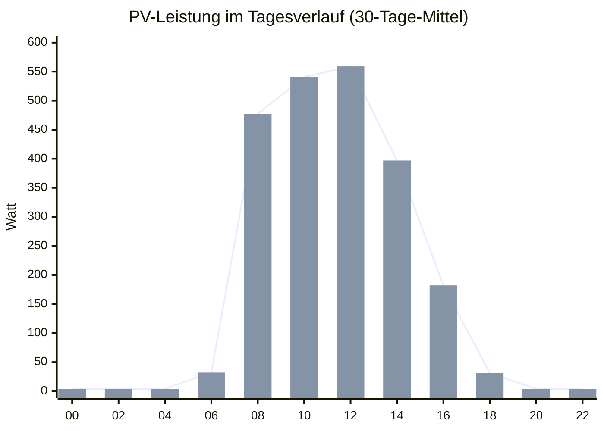
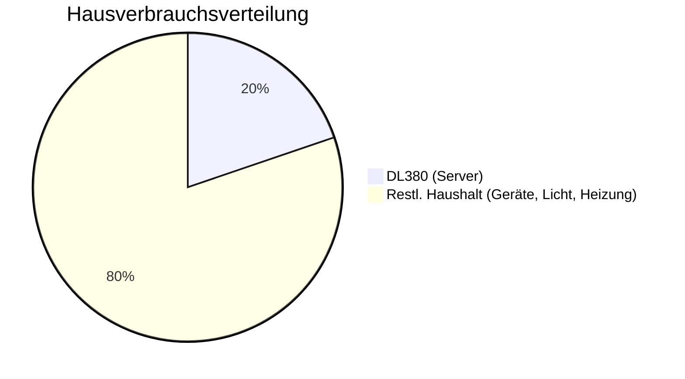
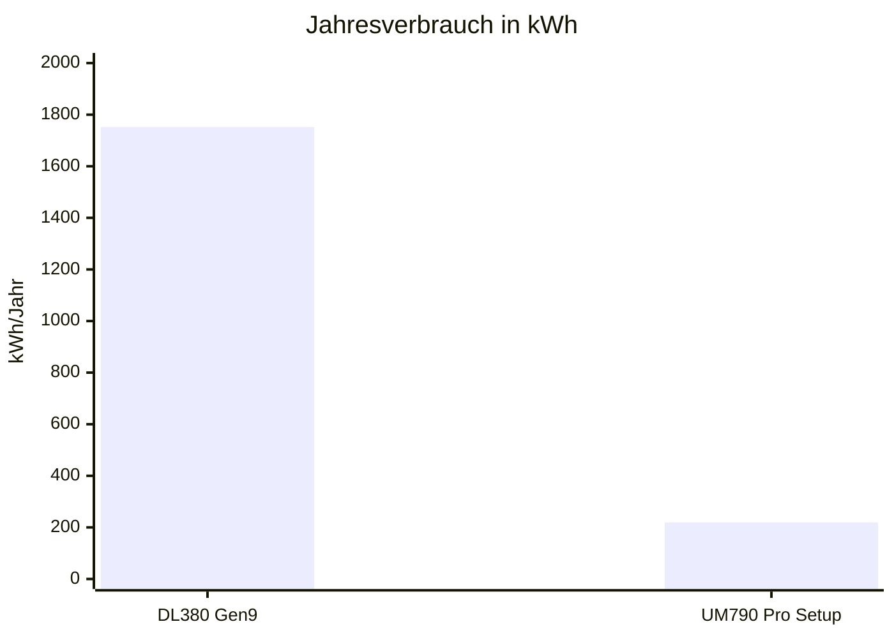
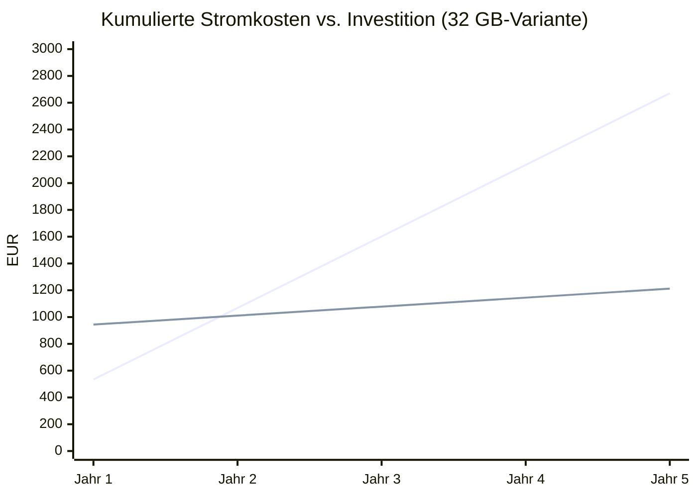
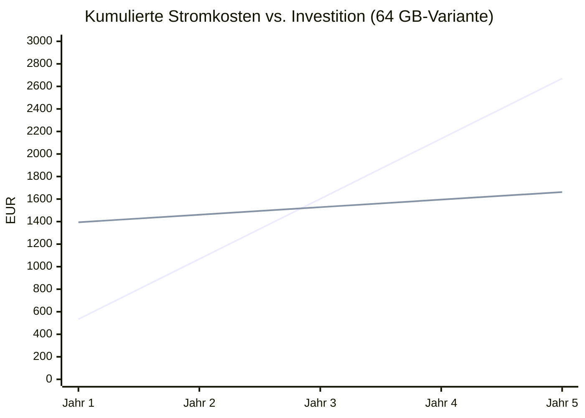
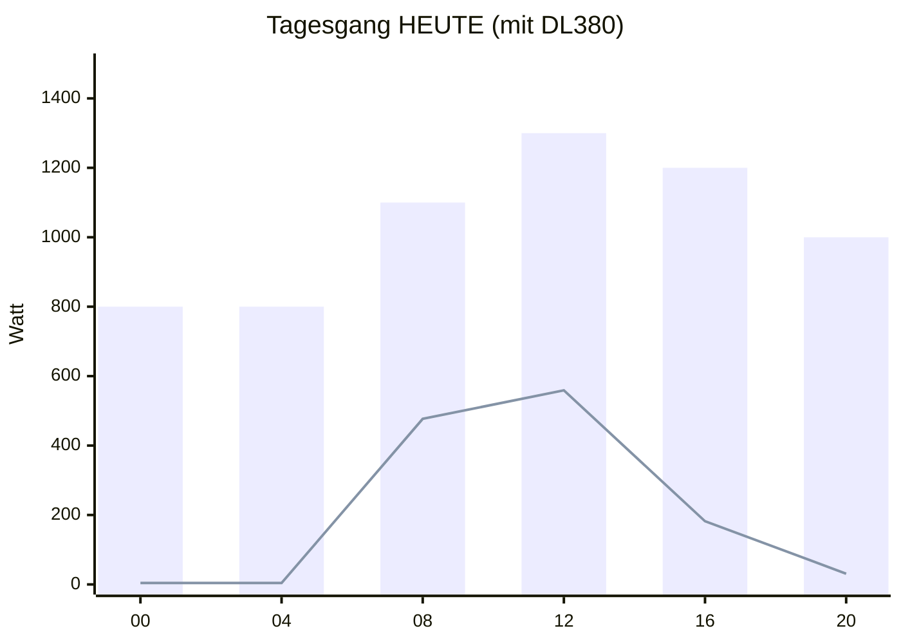
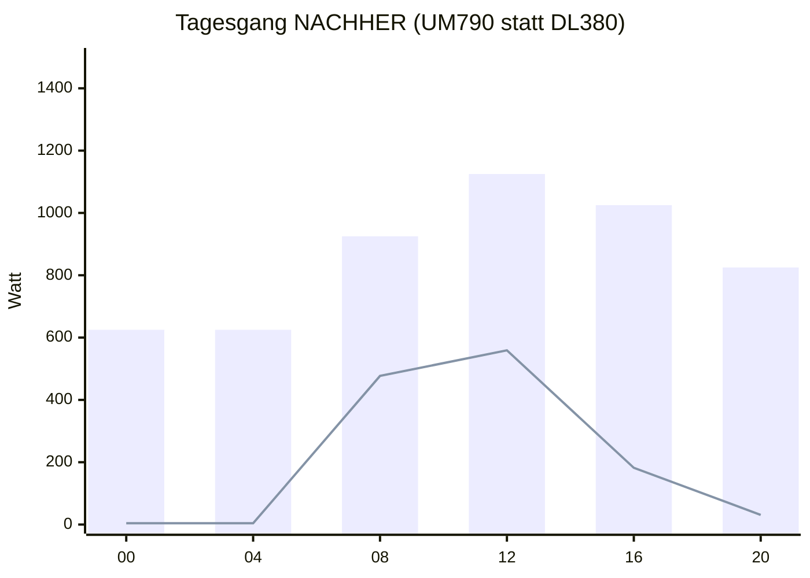
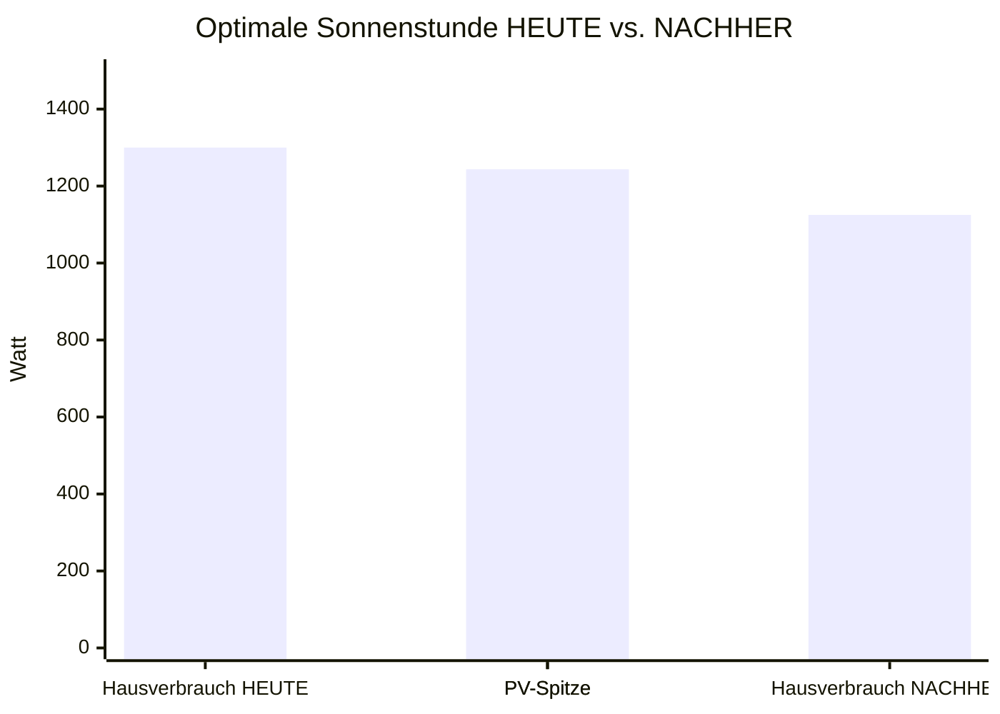
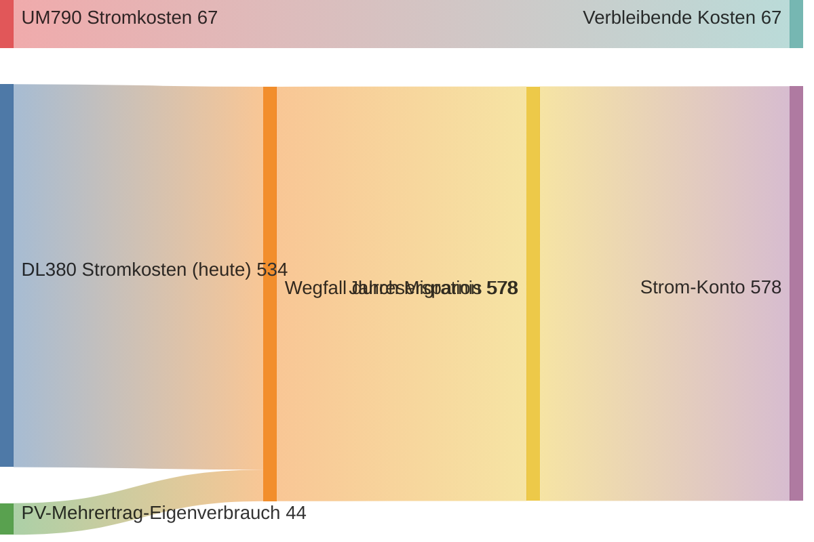
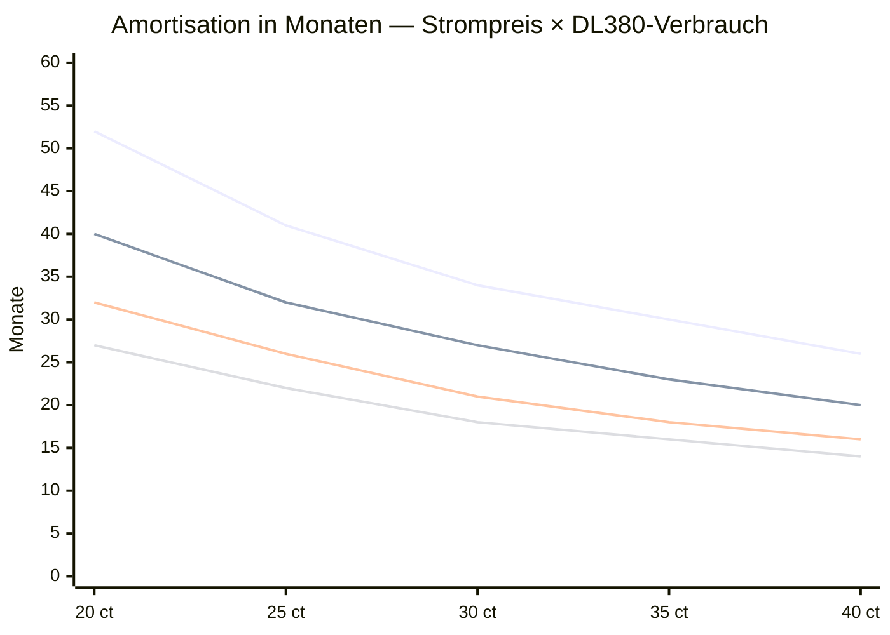

# 05 — Einsparungen, ROI & PV-Synergie

> Alle Zahlen in diesem Dokument stammen aus **realen 30-Tage-
> Messungen** des Hausstromkreises via Tibber Pulse und PV-Inverter,
> ausgelesen über die Home-Assistant-API am 25.05.2026.

## Strompreis-Realität

Tibber dynamische Preise, 30-Tage-Periode 25.04.–25.05.2026
(SWM-Netzgebiet):

| Kennzahl | Wert |
|---|---|
| **Median** | **30,53 ct/kWh** |
| Mittelwert | 27,98 ct/kWh |
| Minimum (Negativstrom) | −42,13 ct/kWh |
| Maximum (Peak) | 59,76 ct/kWh |
| Anzahl Datenpunkte | 2.231 |

→ **Median von 30,5 ct/kWh** ist die ehrlichste Vergleichsbasis (robust
gegen Ausreißer). Alle ROI-Rechnungen erfolgen mit 30 ct/kWh.

## Hausverbrauch-Profil

Gemessen über Tibber Pulse direkt am Smart-Meter (gesamter Hausstrom):

| Kennzahl (30 Tage) | Wert |
|---|---|
| Mittlere Leistung | **1.012 W** (24/7) |
| Min | 185 W (Nachts) |
| Max | 6.837 W (Spitzen mit Backofen / Trockner) |
| Tagesverbrauch | 24,3 kWh |
| Jahreshochrechnung | ~8.866 kWh |
| Jahresstromkosten @ 30 ct/kWh | ~2.660 € (ohne PV-Eigenverbrauch) |

## PV-Erzeugung — der versteckte Hebel

Die kleine bestehende PV-Anlage liefert über den Tagesverlauf folgendes
Profil (30-Tage-Mittel, alle Wetterlagen):

| PV-Kennzahl (30 Tage) | Wert |
|---|---|
| Mittlere Leistung (24h) | 277 W |
| Mittlere Leistung Tagsüber (8–16 Uhr) | 410 W |
| Spitze | 1.243 W |
| Tageserzeugung | 6,65 kWh |
| Jahreshochrechnung | ~2.426 kWh |
| Bisheriger Gesamtertrag | 3.099 kWh |

## Stromverbrauch des HP DL380 Gen9 — der dicke Brocken

Der DL380 Gen9 zieht **ca. 200 W kontinuierlich** (Idle/leichte Last).
Das sind **~20 % des gesamten Hausstrombezugs**.

Kostenrechnung DL380:

| Kennzahl | Wert |
|---|---|
| Leistung kontinuierlich | 200 W |
| Stromverbrauch pro Jahr | 1.752 kWh |
| **Jahreskosten @ 30,5 ct/kWh** | **534 €/Jahr** |

## Stromverbrauch UM790 Pro Setup — der Sparer

Realistische Last (Proxmox + OPNsense + 2–3 kleine VMs aktiv):

| Kennzahl | Wert |
|---|---|
| Idle | ~13 W |
| Typischer Mix-Betrieb | **~25 W** |
| Volllast (selten) | ~70 W |
| Jahresverbrauch (25 W avg) | 219 kWh |
| **Jahreskosten @ 30,5 ct/kWh** | **67 €/Jahr** |

## Direktvergleich

| Kennzahl | DL380 | UM790 | Ersparnis |
|---|---|---|---|
| Leistung 24/7 | 200 W | 25 W | −87,5 % |
| kWh/Jahr | 1.752 | 219 | −1.533 kWh |
| **€/Jahr @ 30,5 ct** | **534 €** | **67 €** | **−467 €/Jahr** |
| CO₂/Jahr @ DE-Mix 380 g/kWh | 666 kg | 83 kg | **−583 kg CO₂/Jahr** |

## ROI / Amortisation

### Variante B (32 GB RAM, Investition ~877 €)

| Zeitraum | DL380 weiter | UM790 (Invest 877 €) | Kumulierter Gewinn UM790 |
|---|---|---|---|
| 6 Monate | 267 € | 911 € | −644 € |
| 12 Monate | 534 € | 944 € | −410 € |
| 18 Monate | 801 € | 977 € | −176 € |
| **20 Monate** ⭐ | **890 €** | **989 €** | **−99 € (nahe Break-Even)** |
| 24 Monate | 1.068 € | 1.011 € | **+57 €** |
| 60 Monate | 2.670 € | 1.212 € | **+1.458 €** |

### Variante A (64 GB RAM, Investition ~1.327 €) — DDR5-Preis-Korrektur Mai 2026

| Zeitraum | DL380 weiter | UM790 (Invest 1.327 €) | Kumulierter Gewinn UM790 |
|---|---|---|---|
| 12 Monate | 534 € | 1.394 € | −860 € |
| 24 Monate | 1.068 € | 1.461 € | −393 € |
| **31 Monate** ⭐ | **1.376 €** | **1.500 €** | **−124 € (Break-Even)** |
| 36 Monate | 1.602 € | 1.528 € | **+74 €** |
| 60 Monate | 2.670 € | 1.662 € | **+1.008 €** |

→ DDR5-RAM-Preise sind 2026 wegen HBM/AI-Nachfrage stark gestiegen. **Variante B (32 GB)** ist klar empfohlen — der reale RAM-Bedarf liegt nur bei 16 GB und das Upgrade auf 64 GB kann später günstiger (DDR5-Preise sinken erwartet) nachgezogen werden.

> **Mit jeder Strompreiserhöhung verkürzt sich die Amortisation.**
> Steigt der Tibber-Median auf 35 ct/kWh (mittelfristig nicht
> unrealistisch), verkürzt sich Break-Even auf ~19 Monate.

## Die PV-Synergie — der heimliche Gamechanger

Aktuell mit DL380 als 200-W-Dauerlast deckt die kleine PV-Anlage den
Hausverbrauch **nie vollständig** — selbst zur Mittagszeit fehlen
~500 W:

- **Hellblauer Balken** = Hausverbrauch inkl. DL380 (Schätzung)
- **Gelbe Linie** = PV-Erzeugung
- → Die PV-Linie liegt **immer unter** dem Verbrauchsbalken. **0 %
  Autarkie-Stunden** in dieser Periode.

### Nach DL380-Abschaltung

- Hausverbrauch **−175 W** gegenüber vorher
- PV-Linie nähert sich der Verbrauchslinie deutlich
- Zur Mittagszeit (12–13 Uhr) ist PV-Anteil rechnerisch über **50 %**
  des Verbrauchs

### Bei Sonnen-Spitze (PV max 1.243 W)

- **Heute**: PV-Spitze (1.243 W) reicht **knapp nicht** für den Hausverbrauch (1.300 W) → 57 W Restbezug aus dem Netz
- **Nachher**: PV-Spitze **übersteigt** den Hausverbrauch (1.125 W) → **PV deckt den vollen Verbrauch ab, ggf. Überschuss-Einspeisung**

→ Erstmals seit Inbetriebnahme der PV-Anlage gibt es **vollständig
autarke Sonnenstunden**. Eigenverbrauchsquote steigt von ~27 % auf ~33 %.

### Jahresbilanz PV-Eigenverbrauch

| Szenario | PV-Eigenverbrauch | Eingesparter Netzbezug | Zusätzliche Ersparnis @ 30,5 ct |
|---|---|---|---|
| Heute (mit DL380) | ~27 % | 655 kWh/Jahr | 200 €/Jahr |
| Nachher (ohne DL380) | ~33 % | 800 kWh/Jahr | **244 €/Jahr** |
| Differenz | +6 PP | +145 kWh/Jahr | **+44 €/Jahr** |

## Gesamtbilanz pro Jahr

| Komponente | Effekt | €/Jahr |
|---|---|---|
| DL380 Stromkosten Wegfall | + | +534 € |
| UM790 Stromkosten neu | − | −67 € |
| PV-Eigenverbrauchs-Bonus | + | +44 € |
| **Nettoersparnis pro Jahr** | | **511 €** |

→ Realer ROI: **877 € / 511 €/Jahr = 1,72 Jahre ≈ 21 Monate**

## Versteckte Bonus-Faktoren

| Faktor | Effekt |
|---|---|
| **Klima/Sommer**: weniger Abwärme im Wohnraum | Klima-Anlage muss weniger arbeiten |
| **Lautstärke**: 6 Server-Lüfter weg | Wohnumfeld leiser |
| **Rack-Höheneinheiten**: 2 U frei | Platz für andere Hardware |
| **CO₂-Fußabdruck**: 583 kg/Jahr | gleich ~3.000 km Autofahren weniger |
| **Strompreis-Inflation**: konservativ +5 %/Jahr | jeder weitere Cent verstärkt den Vorteil |
| **DL380-Restwert** auf eBay | ~150-300 € realer Verkaufserlös → effektive Invest sinkt |

## Worst-Case-Szenarien

Was wenn die Strompreise sinken oder der DL380 weniger verbraucht
als angenommen?

| Annahme | DL380-Verbrauch | Strompreis | Amortisation |
|---|---|---|---|
| **Best Case** | 250 W | 35 ct | **15 Monate** |
| Standard | 200 W | 30 ct | **21 Monate** |
| Konservativ | 150 W | 25 ct | **34 Monate** |
| **Worst Case** | 120 W | 20 ct | **52 Monate** |

→ Selbst im Worst-Case-Szenario (Strompreis kollabiert, DL380 viel
sparsamer als angenommen) amortisiert sich die Investition **innerhalb
der typischen Hardware-Lebenszeit** von 5 Jahren.

## Sensitivitäts-Heatmap

- Linie 1: DL380 @ 120 W
- Linie 2: DL380 @ 160 W
- Linie 3: DL380 @ 200 W ⭐ (realistisch)
- Linie 4: DL380 @ 250 W (volllast)

## Live-Verifikation nach Migration

Nach DL380-Shutdown soll der Stromzähler-Wert validiert werden:

| Schritt | Was | Mittel |
|---|---|---|
| Tag 0 (DL380 noch an) | Baseline-Messung Hausstrom 24h | HA: `sensor.ltibber_0100100700ff` |
| Tag 1 (DL380 aus) | Differenz-Messung Hausstrom 24h | gleicher Sensor |
| Erwartete Differenz | **−170 bis −200 W** dauerhaft | |
| Validierung | Wenn ≥150 W → Migration erfolgreich | |
| Falls < 100 W | UM790-Konfig optimieren (CPU-Govern, Lüfter, Disk-Spin-Down) | |

## Weiter

→ **[06-integration.md](06-integration.md)** — wie sich die neue
Hardware konkret in das bestehende Netz/Server/Service-Ökosystem
einfügt.
