# 06 — Integration ins bestehende Setup

## Architektur-Vergleich VORHER ↔ NACHHER

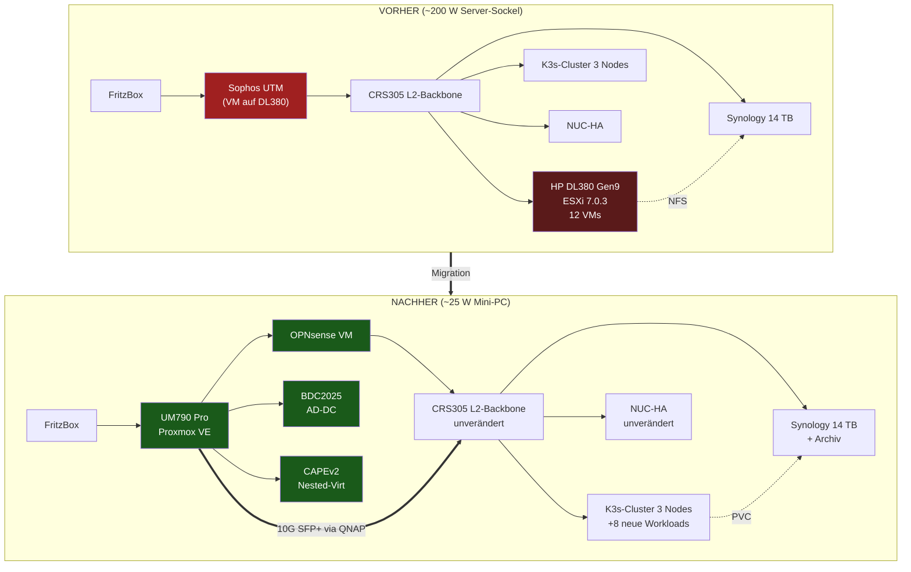

## Komponenten-Übersicht: Was bleibt, was kommt, was geht

### ✅ Unverändert (Stabilitätsanker)

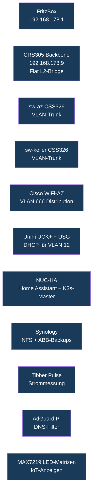

Diese Komponenten werden **nicht angefasst**. Das ist die größte Stärke
der Migration: das produktive Hausnetz bleibt während der gesamten
Migration **online und funktional**.

### 🆕 Neu hinzugefügt

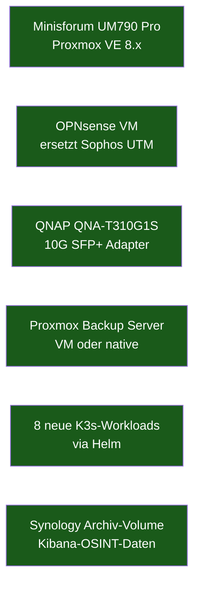

### ❌ Entfernt / abgeschaltet

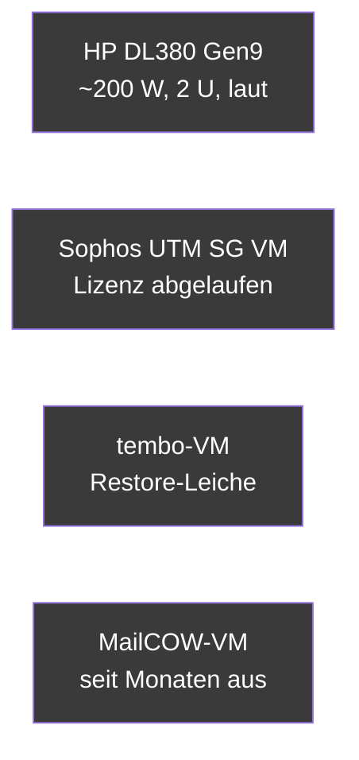

## Integration in die Netz-Layer

### Layer 2 — Switching (CRS305 Backbone)

Der CRS305 als **Flat L2-Bridge** mit Jumbo Frames (MTU 10218) bleibt
exakt wie er ist. Nur **ein zusätzlicher SFP+ Port** wird belegt:

| CRS305 Port | Vorher | Nachher | Speed |
|---|---|---|---|
| sfp1 | sw-keller P25 | sw-keller P25 | 10G SFP+ |
| **sfp2** | unused | **UM790 (QNAP SFP+ Adapter)** | 10G SFP+ |
| sfp3 | Cisco WiFi-WZ | Cisco WiFi-WZ | 10G SFP+ |
| sfp4 | sw-az P24 | sw-az P24 | 10G SFP+ |
| ether1 | unused | unused | 1G RJ45 |

Damit hat der UM790 einen **dedizierten 10G-Pfad** zum Storage-Backbone
und zur Synology — perfekt für VM-Migration und NFS-Storage-Performance.

### Layer 3 — Routing & VLAN-Gateways

Das bestehende VLAN-Schema bleibt **bit-identisch** erhalten — nur die
**Gateway-MAC** wechselt vom Sophos zur OPNsense:

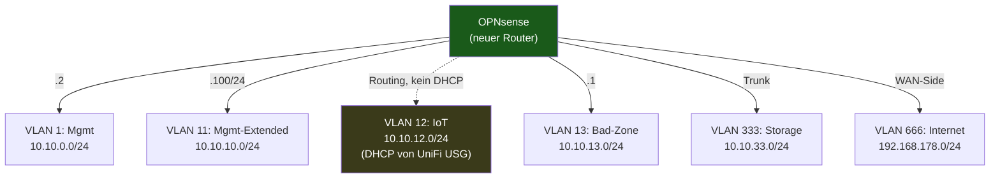

Beim **Cutover** wird **nur die Gateway-IP 10.10.0.2** vom Sophos zur
OPNsense umgezogen. Alle anderen Hosts behalten ihre statischen
Konfigurationen — sie merken den Wechsel nicht.

### Layer 7 — Dienste & Applikationen

Wie integrieren sich die Services?

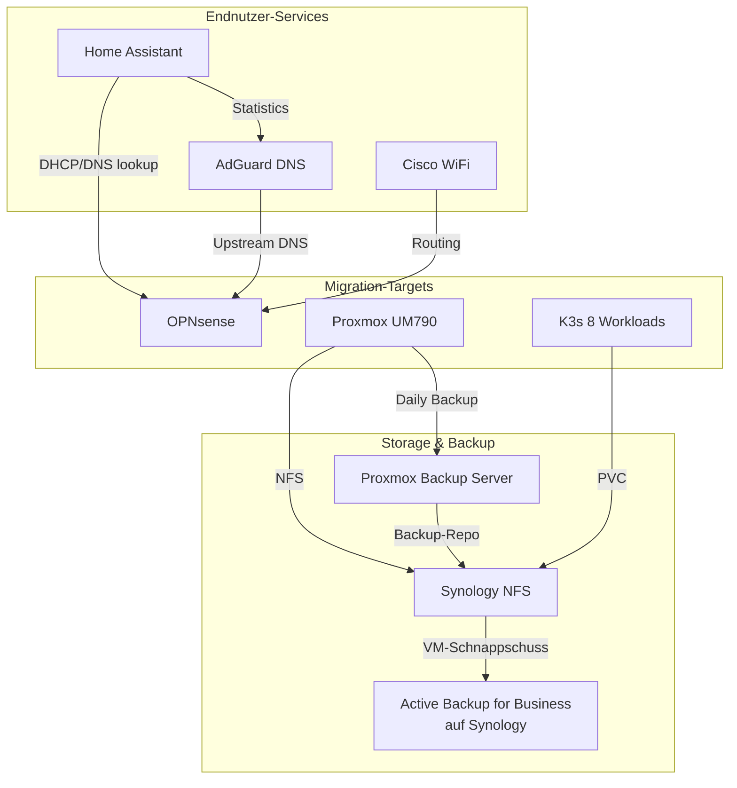

| Service | Heutiges Verhalten | Nach Migration |
|---|---|---|
| Home Assistant | DHCP/DNS von Sophos | DHCP/DNS von OPNsense (transparent) |
| AdGuard Home | Upstream DNS = Sophos | Upstream DNS = OPNsense |
| Cisco/UniFi WiFi | Routing via Sophos | Routing via OPNsense |
| Hetzner-VPN | IPsec via Sophos | WireGuard via OPNsense (Hetzner-Seite parallel umstellen) |
| K3s-Workloads | NUC-HA Master + Worker | unverändert + 8 neue Workloads via Helm |
| Synology NFS | bestehende Exports | + Proxmox-Datastore + K3s-PVCs |
| Tibber Pulse | direkt → HA | unverändert |
| MAX7219 IoT | MQTT zu NUC-HA | unverändert |

## Integration des K3s-Clusters

Der bestehende K3s-Cluster (3 Nodes lt. Memory) übernimmt die
**leichten, containerisierbaren Workloads** vom DL380:

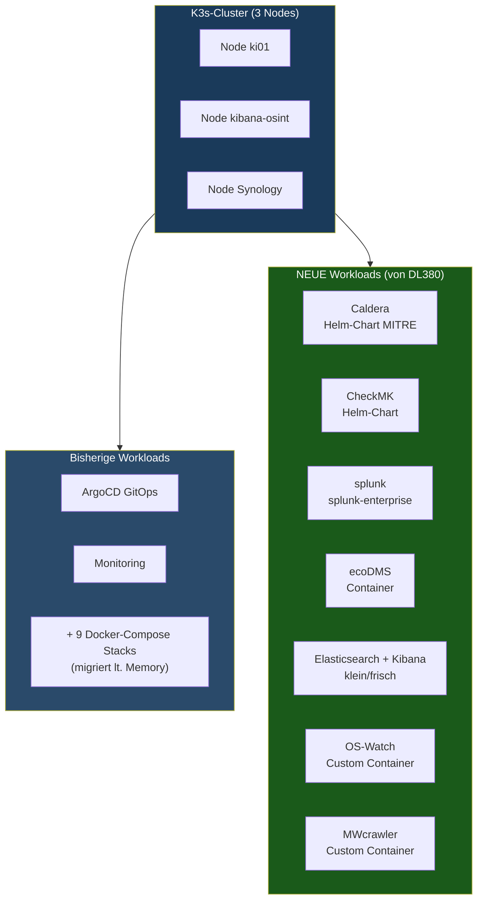

**Ressourcen-Verteilung pro Node** (geschätzt nach Migration):

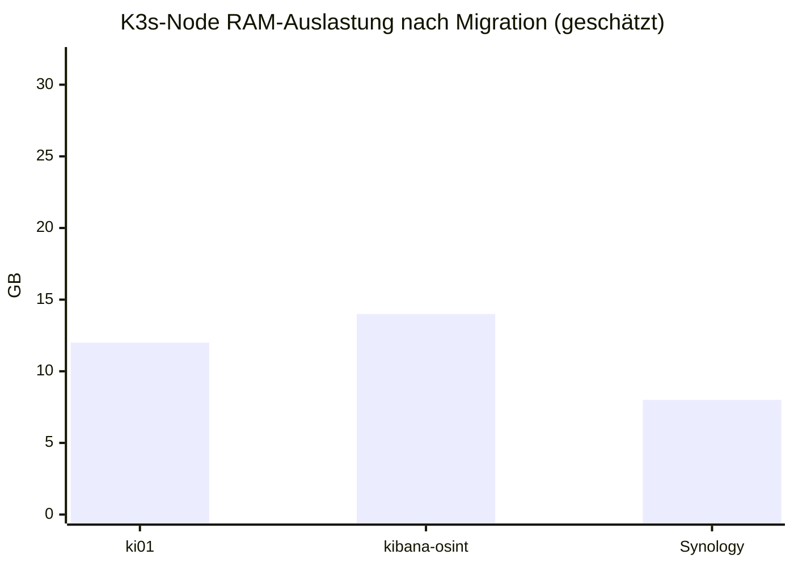

Empfehlung: vor der Migration **Resource-Capacity pro K3s-Node prüfen**:

```bash
kubectl describe node | grep -E "Allocatable|Allocated resources|memory"
```

Wenn die K3s-Nodes RAM-knapp sind: zuerst **dort RAM aufrüsten**, bevor
die Workloads dorthin verschoben werden.

## Integration der Storage-Schicht

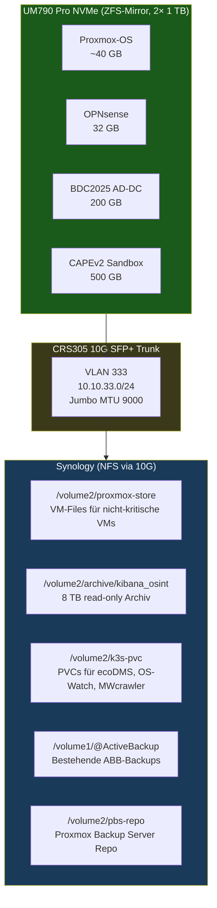

## Hetzner-VPN-Integration

Der bisherige **IPsec-Tunnel** zur Hetzner-Sophos wird auf **WireGuard**
umgestellt:

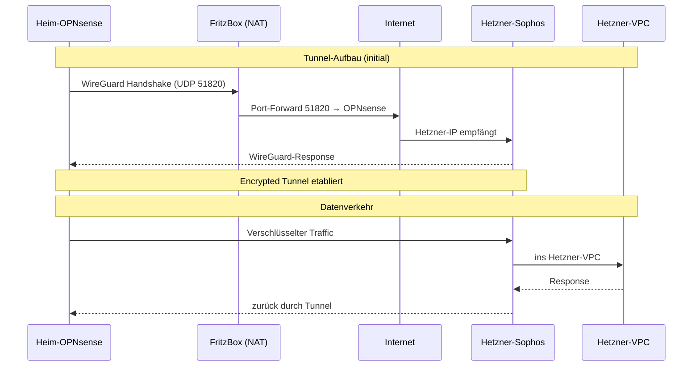

**Vorteile WireGuard gegenüber IPsec**:
- Schnellere Performance auf AMD-Zen4 mit ChaCha20-Poly1305
- Einfachere Konfiguration (kein IKEv2-Phase-1/2 Theater)
- Modernere Crypto, kleiner Footprint
- Roaming-fähig (Re-Keying nahtlos)

## Sicherheits-Integration

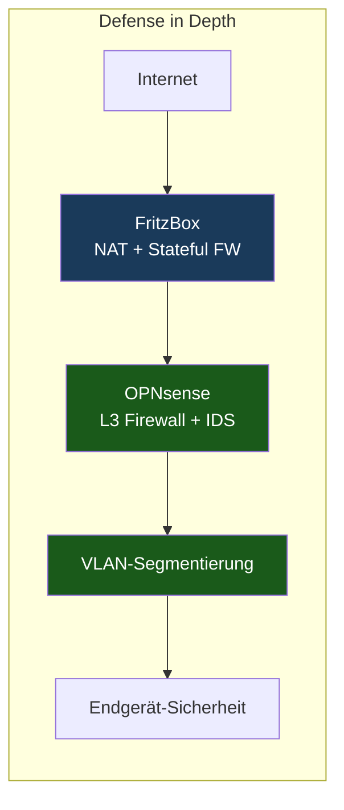

| Sophos-Feature | OPNsense-Equivalent |
|---|---|
| Firewall (Stateful) | OPNsense Filter (PF-basiert) |
| Web-Filter | Web Proxy + Squid + SquidGuard |
| IPS | Suricata Plugin (LISTS Emerging Threats / ETOpen) |
| Anti-Spam | extern (MailCOW falls aktiv) oder Hetzner-Filter |
| WAF | externer Reverse-Proxy (Caddy / nginx-proxy-manager) |
| VPN IPsec/SSL | WireGuard (schneller) + OpenVPN (Roadwarrior) |
| HA / Cluster | OPNsense CARP (optional später) |

## Backup-Strategie

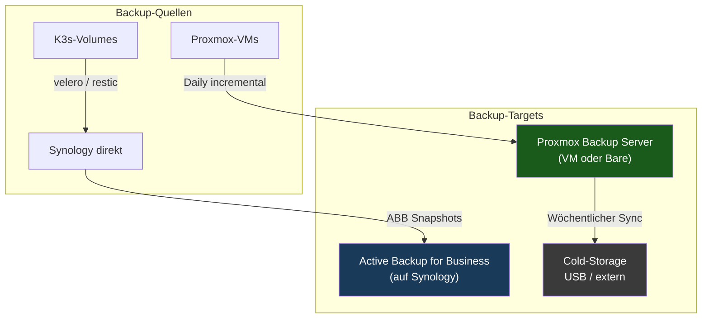

## Tagesablauf nach erfolgreicher Migration

| Aktion | Bisher | Nachher |
|---|---|---|
| Morgens HA-Dashboard prüfen | unverändert | unverändert |
| Firewall-Log einsehen | Sophos Web-Admin | OPNsense Live-View |
| Neue VM erstellen | ESXi vSphere Client | Proxmox Web-UI (browserbasiert!) |
| K8s-Workload deployen | ArgoCD | unverändert |
| Stromverbrauch tracken | Tibber Pulse / HA | Tibber Pulse / HA (jetzt 200 W weniger) |
| Backup-Status | manuell auf Synology | Proxmox-Backup-Dashboard |

## Lessons Learned aus der Architektur

1. **Trennung Compute vs. Storage**: Storage bleibt zentral auf der
   Synology — Compute wird hochskaliert oder reduziert je nach Bedarf.
   Das macht den UM790 austauschbar/erweiterbar.
2. **L2-Backbone unangetastet**: Die CRS305 als Flat-Bridge ist über
   Jahre stabil — kein Grund das anzufassen. Migrationen erfolgen
   **additiv**.
3. **K3s als "Container-Sammelbecken"**: Workloads die nicht zwingend
   VMs sein müssen, gehören auf den K3s. Spart RAM/Disk und gewinnt
   Deklarativität.
4. **Refurbished-Hardware vom Hersteller**: Preis-Leistung wie
   AliExpress, aber mit EU-Versand, Steuer-Klarheit und Garantie. Der
   minisforumpc.eu-Refurb-Shop ist der MVP-Tipp dieses Projekts.

## Weiter

Zurück zu **[README.md](../README.md)** — Übersicht & Status.
