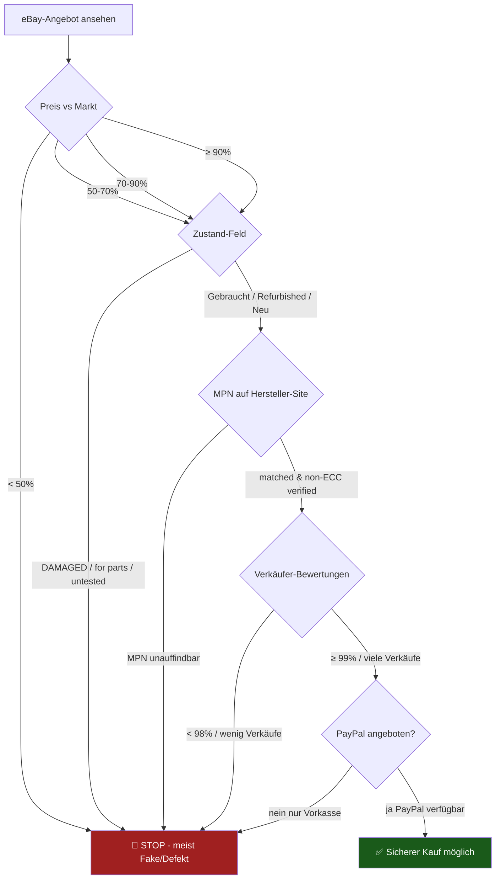

# 07 — Lessons Learned: eBay-RAM-Schnäppchen

## Vorgeschichte

Im Mai 2026 sind während der Hardware-Recherche für dieses Projekt zwei
typische eBay-Fallstricke aufgetaucht — beide lehrreich für künftige
Käufe.

## Fall 1 — Samsung "OEM 64 GB Kit 199 €" (Fake)

**Inserat**: Samsung M425R4GA3BB0-CWM 2× 32 GB DDR5-5600 SODIMM,
angeblich mit 10 Jahren Garantie, 1 Monat Widerrufsrecht, DHL-Versand
aus DE, 99 % positive Verkäufer-Bewertung.

**Marktrealität**: Beim Kontakt mit dem Verkäufer wurde der Preis auf
650 € korrigiert — die 199 € war ein **Lockangebot**.

**Warnsignal**, das ich übersehen habe:
- 199 € sind **~66 % unter Marktpreis** (Crucial-Retail ~600 €)
- Bei DDR5-Preisniveau 2026 ist **alles unter 50 % vom Marktpreis**
  praktisch immer ein Fake, Defekt oder Scam

## Fall 2 — Crucial "32 GB DDR5 für 188 €" (defekt)

**Inserat-Kleingedrucktes**:
> "Product condition: RAM memory DAMAGED - for repair or for parts.
> Memtest errors. Original or replacement packaging."

**Was passiert wäre beim Kauf**:
1. POST funktioniert evtl. trotzdem
2. Proxmox startet
3. ZFS schreibt korrupte Daten wegen RAM-Bit-Flips
4. Silent Data Corruption → VMs werden zerstört
5. Wochenlang unbemerkt, bis nichts mehr bootet

## Sicherheits-Checkliste für eBay-RAM-Käufe

### Verdacht-Indikatoren in Reihenfolge der Wichtigkeit

| Indikator | Aktion |
|---|---|
| 🔴 Zustand-Feld enthält "damaged", "for parts", "untested", "as is", "fault" | **Nicht kaufen** |
| 🔴 Preis < 50 % vom Marktpreis | **Sehr skeptisch** |
| 🔴 Versand aus China, 14-30 Tage Lieferzeit | Vermutlich Fake/Re-Mark |
| 🟡 Stock-Foto statt Verkäufer-Foto | Bei Massenartikeln OK, bei Schnäppchen nicht |
| 🟡 MPN auf Hersteller-Website nicht auffindbar | MPN verifizieren! |
| 🟡 Verkäufer "nur Vorkasse" | PayPal verlangen |
| 🟢 Marktpreis ± 10 %, originale Bilder, 99 % Bewertung, PayPal | OK |

## Realistischer Marktpreis 2026 (Stand Mai)

| Modul | Preis-Range DE |
|---|---|
| Crucial CT2K16G56C46S5 (32 GB Kit DDR5-5600) | 150–200 € |
| Crucial CT2K32G56C46S5 (64 GB Kit DDR5-5600) | 550–650 € |
| Kingston FURY Impact 32 GB Kit | 160–200 € |
| Kingston FURY Impact 64 GB Kit | 580–680 € |
| Samsung OEM single 32 GB Module | 100–140 € (legitim bei seriösen Refurb-Händlern) |

## Goldene Regel

> Bei Hardware, die 24/7 mein Hausnetz und meine Daten managen soll,
> ist die **Garantie wichtiger als die letzten 100 € Ersparnis**.
> Lieber bei Mindfactory/Amazon DE zum Marktpreis kaufen — mit
> 2-Jahres-Gewährleistung, Rückgaberecht und nachvollziehbarer
> Lieferkette.

## Was sich für dieses Projekt ändert

Bestellplan jetzt **konservativ**:

| Position | Was | Preis | Quelle |
|---|---|---|---|
| RAM | Crucial 32 GB Kit (CT2K16G56C46S5) | ~180 € | Mindfactory/Amazon DE |
| RAM-Upgrade später | Crucial 64 GB Kit (CT2K32G56C46S5) | wenn Preise sinken (Ende 2026 erwartet) | Geizhals-Alarm |

**Gesamtinvestition**: ~907 € (Variante B, 32 GB)
**Amortisation**: ~21 Monate

Die ursprünglich erhoffte 64-GB-Vollausstattung kommt
**später per Upgrade**, wenn der DDR5-Markt sich entspannt hat.
